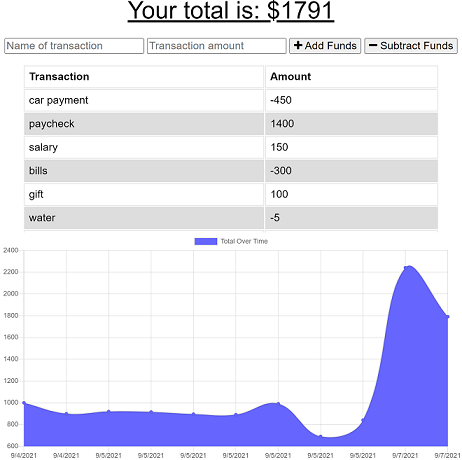

# Budget Tracker
## Version 1.0
## Description
Helps user manage their budget by keeping track of their daily expense, aided with table of expense and a chart. This app can be installed and works offline.  

## Table of Contents
* [License](#license)
* [Installation](#installation)
* [Usage](#usage)
* [Credits](#credits)

## License

## Installation
No installation required. 

[Link to the application](https://limitless-caverns-12620.herokuapp.com/)

## Test
Testing options are not available at the moment

## Usage
* To run this app open the [link](https://limitless-caverns-12620.herokuapp.com/)
* Type in the name of the transaction and the amount, followed by the option to add or subtract funds. 
* Once clicked table and the chart will update. 
* If there is no internet connection funds can be added or subtracted.
* When the app is back online, database will be updated.

## Credits
#### NPM Modules
* [express](https://www.npmjs.com/package/express)
* [mongoose](https://www.npmjs.com/package/mongoose)

#### Users
* Abhishek Jamwal - [GitHub](https://github.com/jamwalab)